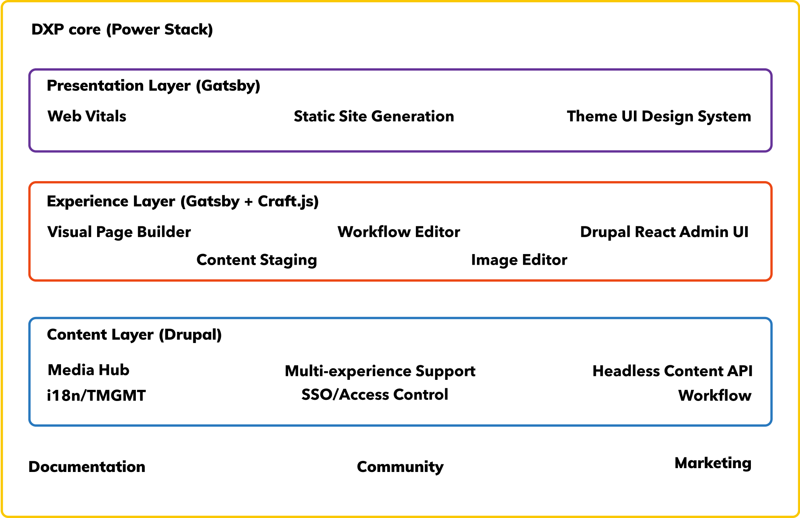

# Overview

Defining the next generation of digital experiences for the web.

## What is Power Stack?

Power Stack is an open-source core stack to enable users to create power web experiences. It leverages the power of
JAM Stack technologies and a headless CMS to bring an unrivaled experience and performance to all users.

Through the power of low-code, website editors can easily create and edit pages. Backed by a world-class CMS, Power
Stack allows for complex editorial workflows, roles and permissions, and all pages support i18n. All this comes without
compromise because with Gatsby your pages remain blazing fast.

<iframe src="https://docs.google.com/presentation/d/e/2PACX-1vSYK-vG9oYTDHJn33P469cju0iDR3BtiYGhojTA1jQis3HMbBwYgId_GjeO6XCDMOoh4ynfdphKVrJb/embed" frameborder="0" width="100%" height="450" allowfullscreen="true" mozallowfullscreen="true" webkitallowfullscreen="true"></iframe>

## Key technologies

The key technologies used in Power Stack are:

- Drupal
- Tina
- Gatsby
- Docksal

## Core Principles

At the core of Power Stack, there are some key principles that guide the development of this project.
- End users come first
- Integrated decoupled services
- Secure by design
- Performant by design
- Zero configuration local development
- Swappable-data agnostic layers
- Extensible and accessible

### So what does this all mean in reality?

Power Stack should first and foremost focus on being "usable" for its end users which are the CMS editors.  "Usability"
needs to cover a range of different facets and features.
- Beautiful, easy to use, and accessible Admin UI
- Fast, themeable website that can handle all sorts of traffic loads
- Extensible management features via workflows and roles
- Accessible and translatable for all
- Flexibility that remains secure through Static Site Generation (SSG)

## What's included

- Performant pageload times
- True WYSIWYG editor
- Roles and Permissions
- Content workflows
- Asset Management
