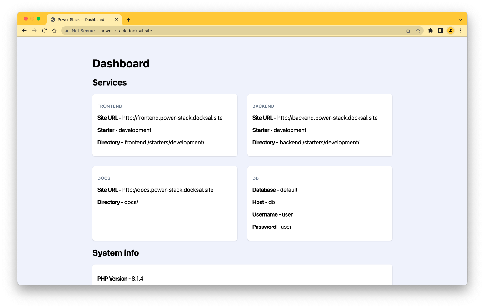

# Using the Dashboard

Getting started with Power Stack Dashboard

## Accessing your dashboard

Once Docksal has been initialised, you will be able to access http://power-stack.docksal.site/.

### Login

When prompted to login, use the credentials provided in the terminal from your install.
